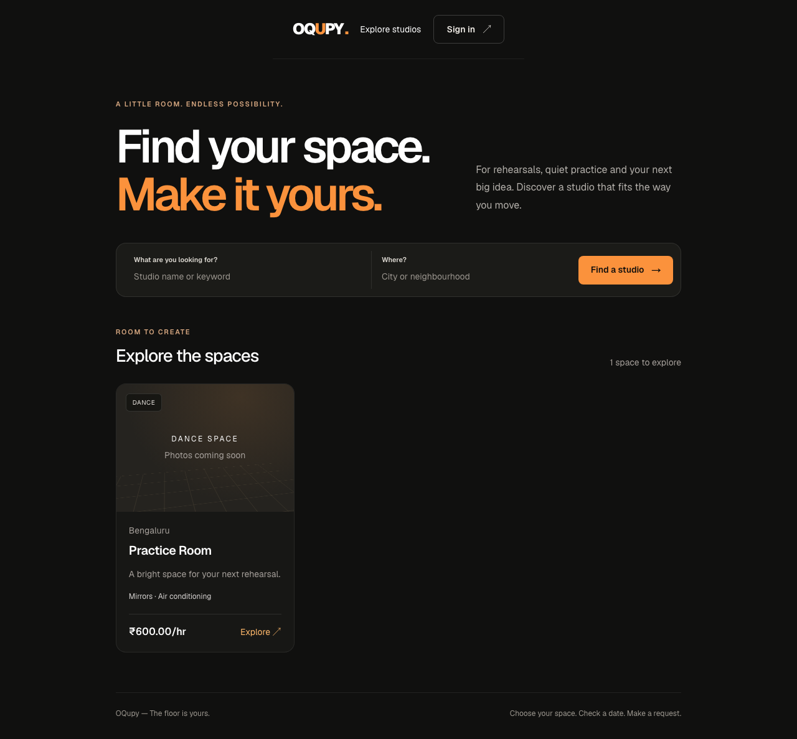
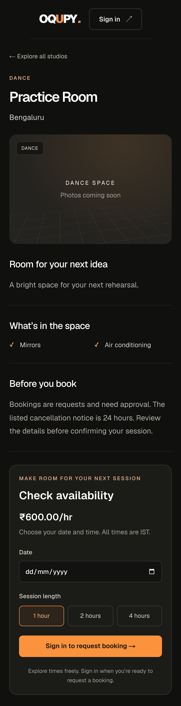

# Studio booking review

Screenshots use isolated Playwright fixture data (not production listings).

## Validation

22 browser/rule checks pass across desktop Chromium in Asia/Kolkata and mobile
Chromium in America/New_York. These cover discovery, search/back navigation,
correctly encoded studio names, OTP login, profile completion, retained selection,
request payload/price, conflicting bookings, failed/stale availability, OTP resend,
invalid-code handling, full-duration availability and horizontal overflow.

The price regression test was run with the previous parseFloat-or-zero behavior:
it failed with expected 600 / received 0 for a legacy currency-prefixed price.
After restoring the fix, the complete suite passes. No coverage quota is used.

Lint and TypeScript pass. The production build passed with Webpack locally;
Turbopack could not bind its worker port in the local sandbox. GitHub CI uses the
normal Turbopack build. The updated dependency audit reported zero vulnerabilities.

## Scope and remaining work

This changes the public discovery/detail/booking journey and auth return flow.
Owner/admin dashboards and the underlying API architecture remain a later UX pass.
Payment is still a request awaiting approval; this UI does not collect money.

Before a production booking launch, address these server contracts in focused PRs:

- Calculate booking price on the server from a validated numeric studio rate.
  The current API still accepts the client's paymentAmount.
- Make availability queries use studio-local day boundaries and include intervals
  that start on a preceding day but overlap the selected date. The existing API
  queries UTC dates; the UI now explicitly shows and submits Indian studio times.
- Add browser-to-real-backend integration coverage for those contracts. The current
  browser suite intercepts API calls; the backend suite independently uses real
  disposable PostgreSQL/Redis.
- Review real listing photos/data and audit the remaining role-specific journeys.

Repository protection and deployment gates need the dashboard settings described
in CONTRIBUTING.md. No production deployment or merge is performed by this PR.
